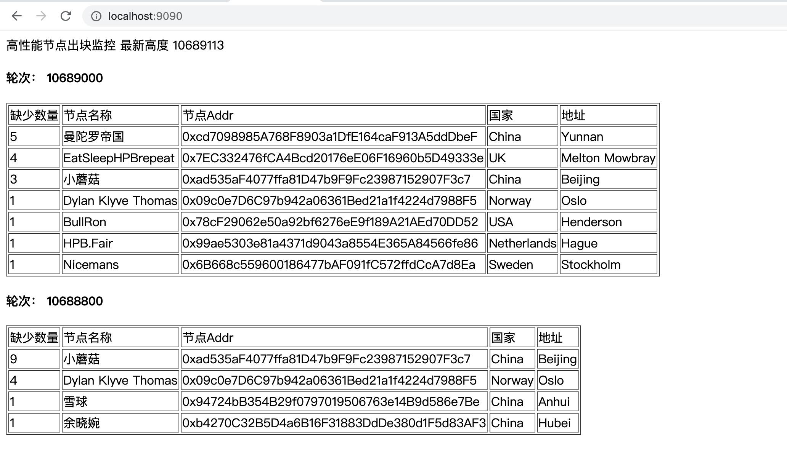

# hpb-monitor

监控高性能节点是否正常出块

# hpb-monitor start

检查从特定范围区块是否正常

```
➜  hpb-monitor git:(main) ✗ ./hpb-monitor start -h
NAME:
    start - Monitor the HPB block chain find who did not produce block

USAGE:
    start [command options] [arguments...]

OPTIONS:
   --hpb-host value       host endpoint of the hpb node (default: "http://hpbnode.com") // 节点地址
   --hpb-scan-host value  host endpoint of the hpb scan (default: "http://hpbscan.org") // 浏览器地址
   --start-block value    block number of the first block to begin scanning (default: 0) // 开始区块高度
   --end-block value      block number of the block to end scanning (default: 0) // 结束区块高度
```

命令例子:

```

./hpb-monitor start --start-block 10563105 --end-block 10563133

```

# hpb-monitor loop

持续监控是否出块

```
➜  hpb-monitor git:(main) ✗ ./hpb-monitor loop -h
NAME:
    loop - Monitor the HPB block chain find who did not produce block

USAGE:
    loop [command options] [arguments...]

OPTIONS:
   --hpb-host value       host endpoint of the hpb node (default: "http://hpbnode.com") // 节点地址
   --hpb-scan-host value  host endpoint of the hpb scan (default: "http://hpbscan.org") // 浏览器地址


```

命令例子:

```

./hpb-monitor loop

```

# 结果显示

```
➜  hpb-monitor git:(main) ✗ ./hpb-monitor loop
HPB last number  10563111
Block number 10563105 should be miner 0xcd7098985A768F8903a1DfE164caF913A5ddDbeF, nodeName 曼陀罗帝国, lockAmount 12109.800651666046, country China, locationDetail Yunnan
Block number 10563112 should be miner 0x78cF29062e50a92bf6276eE9f189A21AEd70DD52, nodeName BullRon, lockAmount 1918.6267879440736, country USA, locationDetail Henderson
Block number 10563121 should be miner 0xad535aF4077ffa81D47b9F9Fc23987152907F3c7, nodeName 小蘑菇, lockAmount 13283.594104013231, country China, locationDetail Beijing
Block number 10563133 should be miner 0xcd7098985A768F8903a1DfE164caF913A5ddDbeF, nodeName 曼陀罗帝国, lockAmount 12109.800651666046, country China, locationDetail Yunnan
Block number 10563138 should be miner 0x7EC332476fCA4Bcd20176eE06F16960b5D49333e, nodeName EatSleepHPBrepeat, lockAmount 44988.921842064185, country UK, locationDetail Melton Mowbray
Block number 10563148 should be miner 0x78cF29062e50a92bf6276eE9f189A21AEd70DD52, nodeName BullRon, lockAmount 1918.6267879440736, country USA, locationDetail Henderson
Block number 10563154 should be miner 0x7EC332476fCA4Bcd20176eE06F16960b5D49333e, nodeName EatSleepHPBrepeat, lockAmount 44988.921842064185, country UK, locationDetail Melton Mowbray

```

# build

make all

# web

启动

```
./hpb-monitor loop
```

http://localhost:9090/

结果如图：


